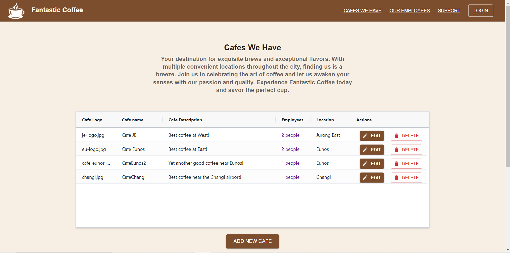
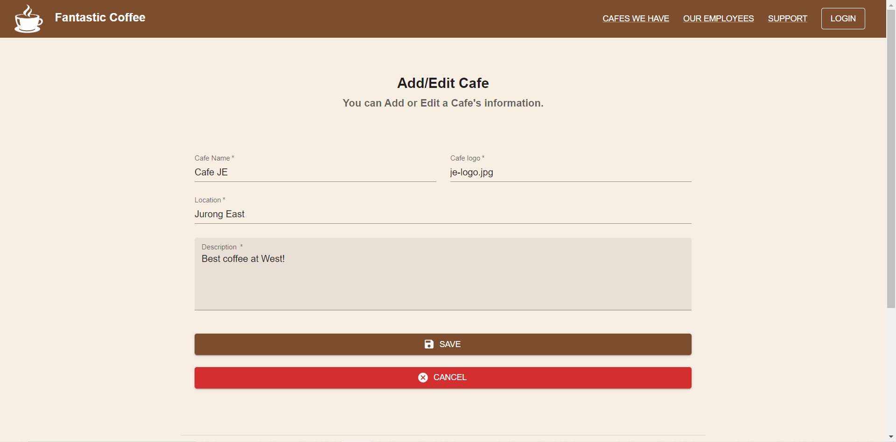
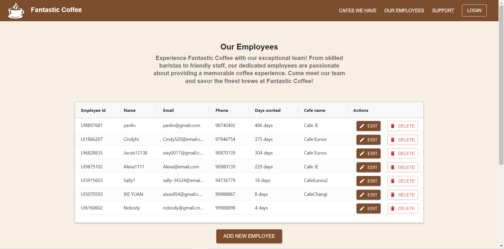
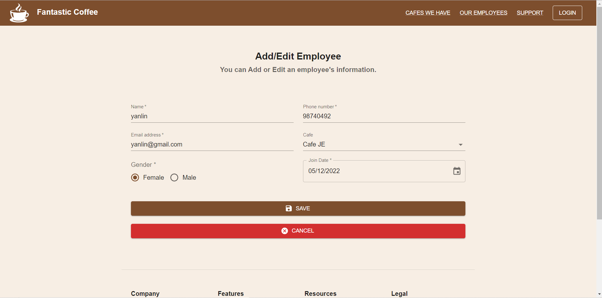
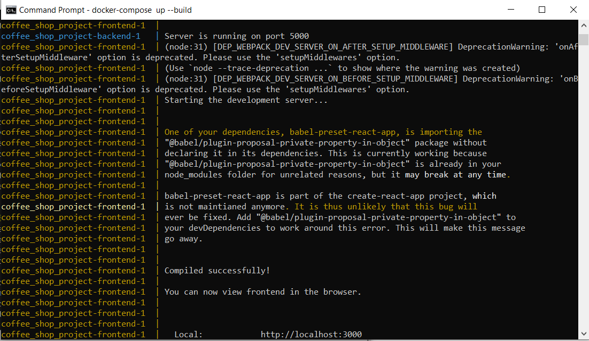

# Getting Started with Full Stack Practice Project

It is Fantastic Cafe website. It is implemented based on requirement.docx

## Download Code
Run 
`git clone https://github.com/Jacob12138xieyuan/cafe-full-stack-website-project.git`
in Git Bash to download all files.
   
## Frontend

It is written in react, redux-toolkit for state management, material UI as CSS framework, agGrid as table component.
It mainly has four pages.
1. /cafes: It renders all available cafes in a table. A button to add new cafe.
   
2. /edit-cafe: It renders a form for user to create/edit a cafe information with basic validation.
   
3. /employees: It renders all employees working in cafes in a table. A button to add new employee.
   (/employees?cafe_id=<cafe_id>: It filter employee by cafe_id) 
4. /edit-employee: It renders a form for user to create/edit an employee information with basic validation.
   

If first time running, run
```npm install``` in /frontend folder to install packages

Start frontend server by running
```npm start``` in /frontend folder

Open [http://localhost:3000](http://localhost:3000) (automatically) to view UI in your browser.

## Backend
It is written in Nodejs (Expressjs), SQLite. It implements RESTful API for the frontend.
1. employees: GET /employees, GET /employees?cafe=<cafe_name>, POST /employees, PUT /employees, DELETE /employees:id
2. cafes: GET /cafes, GET /cafes?location=<location>, POST /cafes, PUT /cafes, DELETE /cafes:id

If first time running, run
```npm install``` in /backend folder to install packages

Start backend server by running
```npm start``` in /backend folder

BaseURL: [http://localhost:5000](http://localhost:5000) to test APIs it in your browser or postman.

## SQLite Database
Data is stored in /backend/db/cafe_project.db file. 
You can use cafe_project.db.sql to restore original data using tool like "DB Browser (SQLite)"

Two tables:
They are linked with "cafe_id". One employee work for one cafe, one cafe has multiple employees.
1. cafes
```
CREATE TABLE IF NOT EXISTS "cafes" (
	"cafe_id"	VARCHAR,
	"cafe_name"	VARCHAR,
	"description"	VARCHAR,
	"location"	VARCHAR,
	"logo"	VARCHAR
);
```
```
INSERT INTO "cafes" ("cafe_id","cafe_name","description","location","logo") VALUES ('cbc738e4-1b41-45ae-9685-dac72c1e69f6','Cafe JE','Best coffee at West!','Jurong East','4.jpg'),
 ('0829a4f1-02cc-40bc-89cc-0b46995ae46e','Cafe Eunos','Best coffee at East!','Eunos','3.jpg'),
 ('0213d17a-a84d-4384-917e-316f62ab0a21','CafeChangi','Best coffee near the Changi airport!','Changi','changi.jpg'),
 ('fcb55957-74c0-4910-9b7a-cb776d8343e9','CafeEunos2','Yet another good coffee near Eunos!','Eunos','cafe-eunos-2.jpg');
```
2. employees
```
CREATE TABLE IF NOT EXISTS "employees" (
	"employee_id"	VARCHAR,
	"name"	VARCHAR,
	"gender"	VARCHAR,
	"email"	VARCHAR,
	"phone"	VARCHAR,
	"join_date"	DATE,
	"cafe_id"	VARCHAR
);
```
```
INSERT INTO "employees" ("employee_id","name","gender","email","phone","join_date","cafe_id") VALUES ('UI6828835','Jacob12138','Male','xiey0017@gmail.com','90870139','2022-11-10','0829a4f1-02cc-40bc-89cc-0b46995ae46e'),
 ('UI9875102','Alexa1111','Female','Alexa@email.com','90980139','2023-01-24','cbc738e4-1b41-45ae-9685-dac72c1e69f6'),
 ('UI1866207','Cindyhi','Female','Cindy520@email.com','97846754','2022-08-31','0829a4f1-02cc-40bc-89cc-0b46995ae46e'),
 ('UI8897681','yanlin','Female','yanlin@gmail.com','98740492','2022-05-12','cbc738e4-1b41-45ae-9685-dac72c1e69f6'),
 ('UI5070593','XIE YUAN','Male','xixxx454@gmail.com','99988867','2023-09-02','0213d17a-a84d-4384-917e-316f62ab0a21'),
 ('UI6160602','Nobody','Male','nobody@gmail.com','99988898','2023-09-06',''),
 ('UI3915603','Sally1','Female','sally-34324@email.com','94736779','2023-08-23','fcb55957-74c0-4910-9b7a-cb776d8343e9');
```

## Run full-stack app in Docker (alternative)
1. Install docker desktop.
   
Run ```docker version``` to verify installation

2. Build and run the Docker containers.
   
Navigate to the root directory of your project (where the docker-compose.yml file is located).
Run the following command to build and run the Docker containers:
```docker-compose up --build```
Docker Compose will read the docker-compose.yml file, build the Docker images based on the Dockerfiles, and create and start the containers.
You should see the output from the frontend and backend containers in the terminal.


3. Access the applications.
   
The React frontend should be accessible at http://localhost:3000.
The Node.js backend should be accessible at http://localhost:5000.